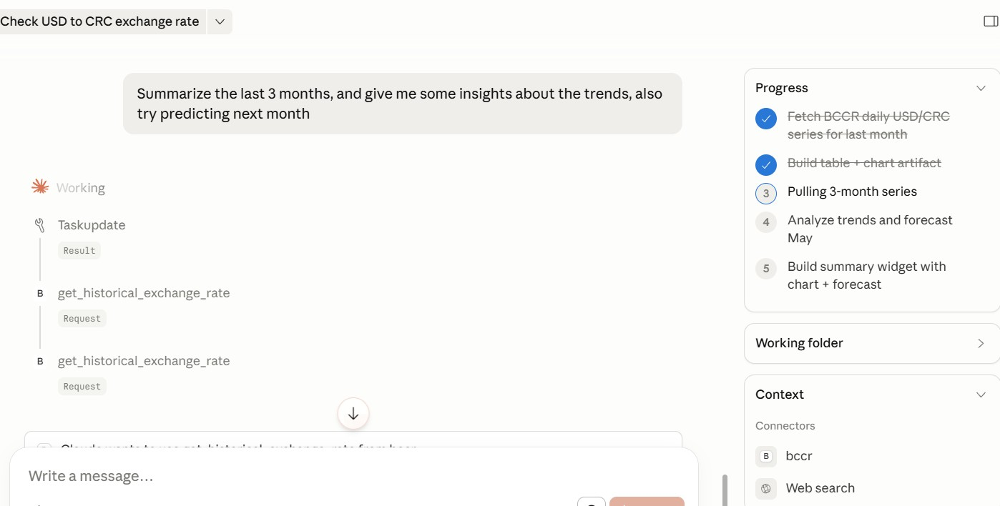
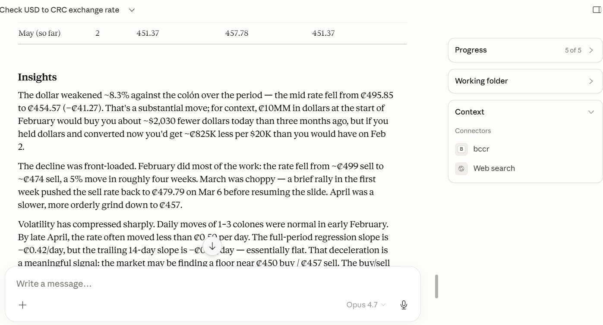

# BCCR MCP Server

An [MCP](https://modelcontextprotocol.io) server that exposes **USD ↔ CRC exchange rates**
published by the **Central Bank of Costa Rica (BCCR)** to MCP-compatible clients such as
Claude Desktop.

> 📚 **Learning resource.** This repo is written as a guided example of an MCP server in
> Python. Every file is heavily commented and there is a dedicated [`docs/`](docs/)
> folder explaining the MCP protocol, the Python idioms used, and a full code
> walkthrough. Start at [`docs/README.md`](docs/README.md).

---
## Demo

### Tool Usage


### Sampling in Action





## What it does

| Tool | Description |
|------|-------------|
| `get_current_exchange_rate` | Returns today's USD/CRC buy (series 317) and sell (series 318) rates in the `America/Costa_Rica` timezone. |
| `get_historical_exchange_rate` | Returns daily rates for a date range up to **3,660 days (~10 years)**. Supports an optional `summarize=true` flag for monthly aggregates and an optional `with_narrative=true` flag (the default) that asks your host's LLM — via MCP **sampling** — to write a one-to-two-sentence trend description. |

### Response shapes at a glance

```jsonc
// get_current_exchange_rate
{ "date": "2026-04-22", "buy": 507.20, "sell": 513.45 }

// get_historical_exchange_rate (summarize=false, default)
{ "rates": [ { "date": "2026-04-18", "buy": 507.2, "sell": 513.5 }, ... ] }

// get_historical_exchange_rate (summarize=true)
{
  "months": [
    {
      "month": "2026-04",
      "buy":  { "min": 506.1, "max": 509.3, "mean": 507.5, "first": 507.2, "last": 508.1 },
      "sell": { "min": 512.0, "max": 514.9, "mean": 513.2, "first": 513.5, "last": 514.1 }
    }, ...
  ],
  "narrative": "CRC held steady against USD through April, with minor strengthening mid-month."
}
```

Behind the scenes the server talks to the BCCR REST API at
`https://apim.bccr.fi.cr/SDDE/api/Bccr.GE.SDDE.Publico.Indicadores.API` using a bearer
token issued from the user's BCCR developer account.

---

## Tech stack

- **Python 3.11+**
- **[MCP Python SDK](https://github.com/modelcontextprotocol/python-sdk)** (FastMCP-style decorators)
- **`httpx`** for async HTTP to BCCR
- **`pydantic`** for payload validation
- **`python-dotenv`** for local credential loading
- **`pytest`**, **`respx`**, **`ruff`** for tests + lint (dev extra)

Design favors **SOLID** principles and a small, focused surface — no over-engineering.

---

## Install

### 1. Prerequisites

- **Python 3.11 or newer** — confirm with `python --version`.
  The codebase uses `typing.Self`, the `X | Y` type-union syntax, and pydantic v2 features that require 3.11+.
- **Git** — to clone the repo.
- **A BCCR bearer token** — see [Configuration](#configuration--bccr-bearer-token) below. You can install everything and run the test suite *without* a token; you only need it to run the live server.

### 2. Clone

```bash
git clone https://github.com/gilberthg-portfolio/mcp_server_demo.git
cd mcp_server_demo
```

### 3. Create a virtual environment

Isolating the project's dependencies in a venv keeps them separate from your system Python.

```bash
python -m venv .venv
```

The first run can take 10–60 seconds on Windows — it copies the Python interpreter, bootstraps pip, and your antivirus will scan the new files. Subsequent runs are much faster.

### 4. Activate the venv

The command depends on your shell. Your prompt should gain a `(.venv)` prefix after activation.

| Shell | Command |
|-------|---------|
| **PowerShell** (Windows) | `.\.venv\Scripts\Activate.ps1` |
| **cmd** (Windows) | `.venv\Scripts\activate.bat` |
| **Git Bash / WSL** (Windows) | `source .venv/Scripts/activate` |
| **macOS / Linux** | `source .venv/bin/activate` |

> **PowerShell execution-policy hiccup** — if `Activate.ps1` errors out with "running scripts is disabled on this system", run this once and retry:
> ```powershell
> Set-ExecutionPolicy -Scope CurrentUser -ExecutionPolicy RemoteSigned
> ```

You'll need to re-activate the venv each time you open a new terminal in the project. To exit the venv later, run `deactivate`.

### 5. Install the package (editable) + dev extras

```bash
python -m pip install --upgrade pip
python -m pip install -e ".[dev]"
```

What this does:

- `-e` = **editable install** — our source under `src/bccr_mcp_server/` is linked into the venv, so any edit is picked up without reinstalling.
- `.` = install the package whose `pyproject.toml` lives in the current directory.
- `[dev]` = also install the optional `dev` dependency group (`pytest`, `pytest-asyncio`, `respx`, `ruff`). Without `[dev]` you get only the runtime deps.
- `python -m pip` (instead of bare `pip`) sidesteps the `pip.exe` shim, which can hit "Access is denied" on Windows when Defender is still scanning a fresh venv.

### 6. Verify

PowerShell:
```powershell
python -m pip list | Select-String -Pattern "bccr|mcp|httpx|pydantic|pytest|respx|ruff"
```

Bash / macOS / Linux:
```bash
python -m pip list | grep -Ei "bccr|mcp|httpx|pydantic|pytest|respx|ruff"
```

You should see:
- `bccr-mcp-server 0.1.0` with the local path (that's the editable install).
- `mcp`, `httpx`, `pydantic`, `pytest`, `respx`, `ruff` with version numbers.

### 7. Run the test suite

```bash
pytest -q
```

Every test stubs the BCCR HTTP layer with `respx` and mocks `BCCR_TOKEN` — you do **not** need a real token or network access for the tests to pass. A clean run prints a single line like `... 35 passed in 0.42s`.

### Troubleshooting installation

| Symptom | Cause | Fix |
|---------|-------|-----|
| `pip install` fails with "Access is denied" on `pip.exe`. | Windows Defender is still scanning the fresh venv. | Use `python -m pip install …` instead. If it persists, add the repo folder as a Defender exclusion. |
| `Activate.ps1 cannot be loaded because running scripts is disabled`. | PowerShell execution policy. | `Set-ExecutionPolicy -Scope CurrentUser RemoteSigned` (one-time). |
| `Could not find a version that satisfies the requirement …`. | Python older than 3.11. | Install Python 3.11+ and recreate the venv. |
| `ModuleNotFoundError: No module named 'bccr_mcp_server'`. | venv not activated or install didn't complete. | Confirm the `(.venv)` prefix on your prompt; re-run the install. |
| `pytest` output says `collected 0 items`. | You're running `pytest` from outside the `mcp_server_demo` folder. | `cd` into the repo root first. |

---

## Configuration — BCCR bearer token

You need your **own** BCCR bearer token. Register on the BCCR developer portal, issue a
token there, and supply it to the server — the server never ships with credentials and
never needs your username or password.

Provide the token via one environment variable:

```env
BCCR_TOKEN=your_bearer_token
```

For local development, place it in a `.env` file at the repo root (already in
`.gitignore`). For Claude Desktop, inject it through the `mcpServers.env` block in
`claude_desktop_config.json` (example below).

---

## Using with Claude Desktop

Add an entry to your Claude Desktop config:

```json
{
  "mcpServers": {
    "bccr": {
      "command": "python",
      "args": ["-m", "bccr_mcp_server"],
      "env": {
        "BCCR_TOKEN": "your_bearer_token"
      }
    }
  }
}
```

Restart Claude Desktop and the tools appear under the MCP tool menu.

### A note on sampling & consent prompts

When you call `get_historical_exchange_rate(summarize=True)` with the default
`with_narrative=True`, the server asks Claude Desktop's LLM to write a short trend
narrative via MCP **sampling**. Claude Desktop will show a one-time consent prompt
before fulfilling the request. If you prefer to skip the prompt (e.g. for scripted
usage), pass `with_narrative=False` and the server returns the structured months
payload with no sampling round-trip.

**The narrative is additive commentary, not authoritative data.** The structured
`months` array is always the source of truth; the narrative is a language-model's
paraphrase and may state trends loosely. Cross-check important values against the
numeric response.

---

## How the in-memory cache works

Once the server is running, every historical rate it fetches stays in memory for the
life of the process. Repeated queries for overlapping ranges issue **only one** BCCR
call per session for each previously-unseen date. Today's rate is never cached — it
could flip from "not yet published" to "published" during a session.

The cache is process-local: restart the server (or quit Claude Desktop) and the cache
resets.

---

## Troubleshooting

| Symptom | Likely cause | Fix |
|---------|--------------|-----|
| Server shows an error on Claude Desktop startup about `BCCR_TOKEN`. | The env var wasn't injected (or is empty). | Check the `env` block in your Claude Desktop config. Token goes into `BCCR_TOKEN`. |
| Every tool call returns "Your BCCR bearer token appears to be invalid or expired". | BCCR returned 401. | Issue a new bearer token in the BCCR developer portal and update the env var. |
| Historical tool returns `{"rates": [], "message": "..."}`. | Your date range contains only weekends, holidays, or pre-publication dates. | Widen the range; BCCR publishes Monday–Friday business days only. |
| `get_historical_exchange_rate` rejects a 10-year+ range. | The server caps ranges at 3,660 days. | Split the request into multiple calls. |
| Summarize response has no `narrative` field even though `with_narrative=true`. | The connected client doesn't advertise sampling, or the user rejected the consent prompt. | Either expected. The structured `months` payload is still valid. |
| Tool results look off after a clock change. | Cache entries are process-local and never TTL'd. | Restart the server. |

---

## Development workflow

This repo is authored using the [OpenSpec](https://github.com/open-spec) experimental
workflow (`opsx` series of skills). The design artifacts live outside the published
repo — only the resulting code and [`docs/`](docs/) ship to GitHub. The high-level
rhythm:

1. `/opsx:explore` — capture requirements.
2. `/opsx:ff` — generate proposal + design + spec deltas + tasks in one pass.
3. `/opsx:apply` — implement tasks.
4. `/opsx:archive` — finalize a change after verification.

See [`docs/03-code-walkthrough.md`](docs/03-code-walkthrough.md) for a tour of the
resulting code.

---

## Contributing

Pull requests are welcome. A few norms worth knowing:

- The code is intentionally over-commented so it reads as a teaching artifact — please
  preserve that style on new code. [`docs/02-python-concepts.md`](docs/02-python-concepts.md)
  is the canonical glossary; when a PR introduces a new Python idiom, add a section
  there rather than duplicating explanations in multiple files.
- Keep the MCP surface small. New tools need a design sketch (what question does it
  answer for the model?) before implementation.
- Run `pytest -q` and `ruff check` before pushing. CI will too.

---

## License

TBD — not set yet. Until a license is added, assume "all rights reserved" for the
source; see the Disclaimer below for BCCR data.

---

## Disclaimer

This project is not affiliated with or endorsed by the Banco Central de Costa Rica. Rate
data is fetched live from the bank's public API; the server merely relays it. The
optional narrative feature is LLM-generated commentary and can contain mistakes — treat
the structured numeric payload as authoritative.
